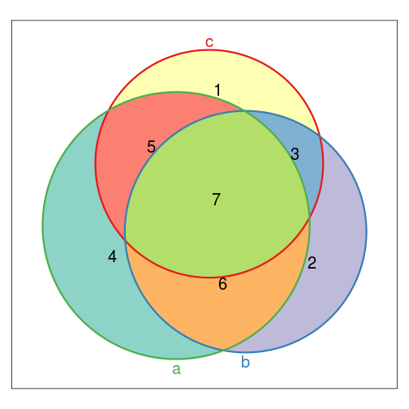
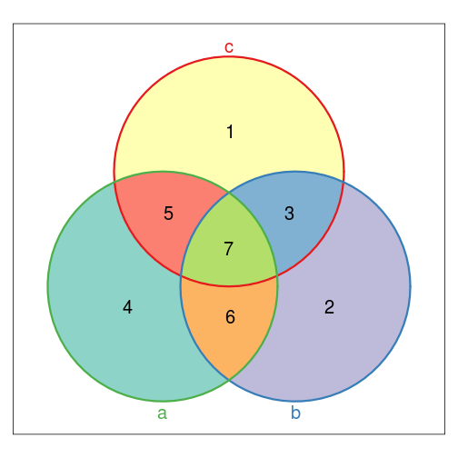
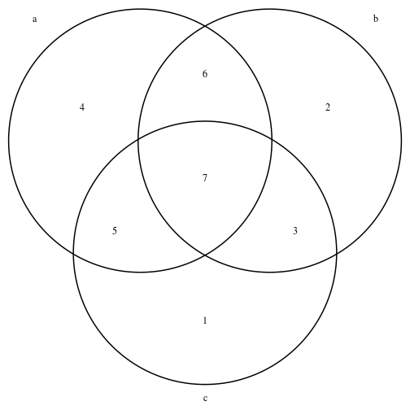
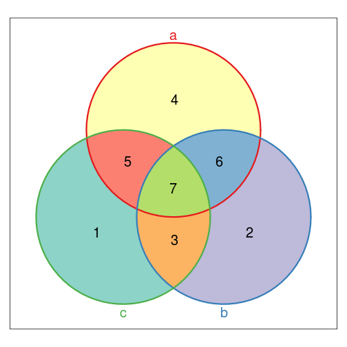

% Ying Wu 2013/12
% knit("vennExamples.Rmd"); knit2html("vennExamples.md")
% mv vennExamples.md README.md

# Examples of Venn Diagram generation

There are multiple ways to input data for venn diagrams. This document will go over 3 of the common input methods that I have encountered:

## Compressed Vector (Vennerable package)
Each overlap for venn diagram is encoded in a vector where the vector index  
can be converted into a binary number that corresponds to membership in set of venn diagram.


    abc
    000 001 010 011 100 101 110 111
      0   1   2   3   4   5   6   7

`011` represents shared membership (overlap) of set b and set c


**Example**

```r
library(Vennerable)  #https://r-forge.r-project.org/projects/vennerable/
venn_vector = c(0, 1, 2, 3, 4, 5, 6, 7)  #note the 0 in beginning, cannot have name
plot(Venn(SetNames = c("c", "b", "a"), Weight = venn_vector))  #weighted by default, note set name change
```

 

```r
plot(Venn(SetNames = c("c", "b", "a"), Weight = venn_vector), doWeights = FALSE)
```

 

```r
# Vennerable can plot up to 5 way venns and has many more parameters, see
# manual for more details
```


## Binary matrix (limma package)
This is a matrix with columns equal to the number of sets in Venn Diagram 
rows representing each element and TRUE/FALSE representing element membership in each set


    a       b       c
    FALSE   FALSE   TRUE
    FALSE   TRUE    FALSE
    FALSE   TRUE    FALSE
    FALSE   TRUE    TRUE
    FALSE   TRUE    TRUE
    FALSE   TRUE    TRUE
    TRUE    FALSE   FALSE
    TRUE    FALSE   FALSE
    TRUE    FALSE   FALSE
    TRUE    FALSE   FALSE
    ... see appendix for full matrix ...


**Example**

```r
library(limma)  #http://www.bioconductor.org/packages/release/bioc/html/limma.html
venn_matrix = cbind(a = c(rep(c(FALSE, TRUE), c(6, 22))), b = c(FALSE, rep(c(TRUE, 
    FALSE, TRUE), c(5, 9, 13))), c = c(TRUE, rep(c(FALSE, TRUE, FALSE, TRUE, 
    FALSE, TRUE), c(2:7))))
vennDiagram(vennCounts(venn_matrix))
```

 


## Identifier list (Venn Diagram package)
This is a list where object in list holds unique IDs that need to be overlapped for venn diagram.


    a
    7 8 9 10 11 12 13 14 15 16 17 18 19 20 21 22 23 24 25 26 27 28
    b
    2 3 4 5 6 16 17 18 19 20 21 22 23 24 25 26 27 28
    c
    1 4 5 6 11 12 13 14 15 22 23 24 25 26 27 28


**Example**

```r
library(VennDiagram)
venn_list = list(a = c(7, 8, 9, 10, 11, 12, 13, 14, 15, 16, 17, 18, 19, 20, 
    21, 22, 23, 24, 25, 26, 27, 28), b = c(2, 3, 4, 5, 6, 16, 17, 18, 19, 20, 
    21, 22, 23, 24, 25, 26, 27, 28), c = c(1, 4, 5, 6, 11, 12, 13, 14, 15, 22, 
    23, 24, 25, 26, 27, 28))
grid.draw(venn.diagram(x = venn_list, filename = NULL, scaled = TRUE))  #will draw over current plot
```

 


## Conversion Function
To convert between the these 3 types I created a function [`convertVennInput.R`](convertVennInput.R)

Example:

```r
source("convertVennInput.R")

new_vennlist = convertVennInput(venn_matrix, type = "list")  #matrix -> list
new_vennvector = convertVennInput(venn_matrix, type = "vector")  #matrix -> vector
new_vennmatrix = convertVennInput(venn_vector, type = "matrix")  #vector -> matrix
new_vennlist = convertVennInput(venn_vector, type = "list")  #vector -> list
new_vennvector = convertVennInput(venn_list, type = "vector")  #list -> vector
new_vennmatrix = convertVennInput(venn_list, type = "matrix")  #list -> matrix

# Example of using Venn() from Vennerable package Venn() can use
# identifier list with Set= or use compressed vector with weight= with
# vector, need to wrap in as.vector() to remove names
plotVenn(Venn(SetNames = c("a", "b", "c"), Weight = as.vector(new_vennvector)), 
    doWeights = F)
```

 

```r
# plot() gives weird error (possibly bug with Vennerable), use plotVenn
# instead
```


**Notes:**

* Vennerable package can do identifier list -> compressed vector using `Venn(Set=)`
* limma package can do binary matrix -> compressed vector using `vennCounts()`

### Todo
show example of diffbind -> venn diagram

# Appendix

```r
venn_vector
```

```
## [1] 0 1 2 3 4 5 6 7
```

```r
venn_matrix
```

```
##           a     b     c
##  [1,] FALSE FALSE  TRUE
##  [2,] FALSE  TRUE FALSE
##  [3,] FALSE  TRUE FALSE
##  [4,] FALSE  TRUE  TRUE
##  [5,] FALSE  TRUE  TRUE
##  [6,] FALSE  TRUE  TRUE
##  [7,]  TRUE FALSE FALSE
##  [8,]  TRUE FALSE FALSE
##  [9,]  TRUE FALSE FALSE
## [10,]  TRUE FALSE FALSE
## [11,]  TRUE FALSE  TRUE
## [12,]  TRUE FALSE  TRUE
## [13,]  TRUE FALSE  TRUE
## [14,]  TRUE FALSE  TRUE
## [15,]  TRUE FALSE  TRUE
## [16,]  TRUE  TRUE FALSE
## [17,]  TRUE  TRUE FALSE
## [18,]  TRUE  TRUE FALSE
## [19,]  TRUE  TRUE FALSE
## [20,]  TRUE  TRUE FALSE
## [21,]  TRUE  TRUE FALSE
## [22,]  TRUE  TRUE  TRUE
## [23,]  TRUE  TRUE  TRUE
## [24,]  TRUE  TRUE  TRUE
## [25,]  TRUE  TRUE  TRUE
## [26,]  TRUE  TRUE  TRUE
## [27,]  TRUE  TRUE  TRUE
## [28,]  TRUE  TRUE  TRUE
```

```r
venn_list
```

```
## $a
##  [1]  7  8  9 10 11 12 13 14 15 16 17 18 19 20 21 22 23 24 25 26 27 28
## 
## $b
##  [1]  2  3  4  5  6 16 17 18 19 20 21 22 23 24 25 26 27 28
## 
## $c
##  [1]  1  4  5  6 11 12 13 14 15 22 23 24 25 26 27 28
```

```r

new_vennvector
```

```
## 0 1 2 3 4 5 6 7 
## 0 4 2 6 1 5 3 7
```

```r
new_vennmatrix
```

```
##        a     b     c
## 1  FALSE FALSE  TRUE
## 2  FALSE  TRUE FALSE
## 3  FALSE  TRUE FALSE
## 4  FALSE  TRUE  TRUE
## 5  FALSE  TRUE  TRUE
## 6  FALSE  TRUE  TRUE
## 7   TRUE FALSE FALSE
## 8   TRUE FALSE FALSE
## 9   TRUE FALSE FALSE
## 10  TRUE FALSE FALSE
## 11  TRUE FALSE  TRUE
## 12  TRUE FALSE  TRUE
## 13  TRUE FALSE  TRUE
## 14  TRUE FALSE  TRUE
## 15  TRUE FALSE  TRUE
## 16  TRUE  TRUE FALSE
## 17  TRUE  TRUE FALSE
## 18  TRUE  TRUE FALSE
## 19  TRUE  TRUE FALSE
## 20  TRUE  TRUE FALSE
## 21  TRUE  TRUE FALSE
## 22  TRUE  TRUE  TRUE
## 23  TRUE  TRUE  TRUE
## 24  TRUE  TRUE  TRUE
## 25  TRUE  TRUE  TRUE
## 26  TRUE  TRUE  TRUE
## 27  TRUE  TRUE  TRUE
## 28  TRUE  TRUE  TRUE
```

```r
new_vennlist
```

```
## $`4`
##  [1]  7  8  9 10 11 12 13 14 15 16 17 18 19 20 21 22 23 24 25 26 27 28
## 
## $`2`
##  [1]  2  3  4  5  6 16 17 18 19 20 21 22 23 24 25 26 27 28
## 
## $`1`
##  [1]  1  4  5  6 11 12 13 14 15 22 23 24 25 26 27 28
```

```r

sessionInfo()
```

```
## R version 2.15.3 (2013-03-01)
## Platform: x86_64-pc-linux-gnu (64-bit)
## 
## locale:
##  [1] LC_CTYPE=en_US.utf8       LC_NUMERIC=C             
##  [3] LC_TIME=en_US.utf8        LC_COLLATE=en_US.utf8    
##  [5] LC_MONETARY=en_US.utf8    LC_MESSAGES=en_US.utf8   
##  [7] LC_PAPER=C                LC_NAME=C                
##  [9] LC_ADDRESS=C              LC_TELEPHONE=C           
## [11] LC_MEASUREMENT=en_US.utf8 LC_IDENTIFICATION=C      
## 
## attached base packages:
## [1] grid      stats     graphics  grDevices utils     datasets  methods  
## [8] base     
## 
## other attached packages:
##  [1] VennDiagram_1.6.4  limma_3.14.4       Vennerable_2.2    
##  [4] xtable_1.7-1       gtools_2.7.1       reshape_0.8.4     
##  [7] plyr_1.8           RColorBrewer_1.0-5 lattice_0.20-15   
## [10] RBGL_1.34.0        graph_1.36.2       knitr_1.2         
## 
## loaded via a namespace (and not attached):
## [1] BiocGenerics_0.4.0 digest_0.6.3       evaluate_0.4.4    
## [4] formatR_0.8        markdown_0.6.1     stats4_2.15.3     
## [7] stringr_0.6.2      tools_2.15.3
```


Binary matrix (full)

    a       b       c
    FALSE   FALSE   TRUE
    FALSE   TRUE    FALSE
    FALSE   TRUE    FALSE
    FALSE   TRUE    TRUE
    FALSE   TRUE    TRUE
    FALSE   TRUE    TRUE
    TRUE    FALSE   FALSE
    TRUE    FALSE   FALSE
    TRUE    FALSE   FALSE
    TRUE    FALSE   FALSE
    TRUE    FALSE   TRUE
    TRUE    FALSE   TRUE
    TRUE    FALSE   TRUE
    TRUE    FALSE   TRUE
    TRUE    FALSE   TRUE
    TRUE    TRUE    FALSE
    TRUE    TRUE    FALSE
    TRUE    TRUE    FALSE
    TRUE    TRUE    FALSE
    TRUE    TRUE    FALSE
    TRUE    TRUE    FALSE
    TRUE    TRUE    TRUE
    TRUE    TRUE    TRUE
    TRUE    TRUE    TRUE
    TRUE    TRUE    TRUE
    TRUE    TRUE    TRUE
    TRUE    TRUE    TRUE
    TRUE    TRUE    TRUE


Generated:

```
## [1] "Thu Dec 12 16:52:44 2013"
```

